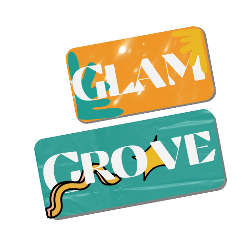

<p align="center">
  <a href="https://example.com/">
    
  </a>

  <h1 align="center">GlamGroove</h3>

  <p align="center">
    B.R.E.A.K.E.R Project | Laravel 10
    <br>
<a href="#Your-Email">Report bug</a>
·
<a href="#Your-Email">Request feature</a>
·
<a href="#Your-Email">Support Us</a>

  </p>
</p>

<p align="center">
<a href="https://github.com/laravel/framework/actions"></a>
<a href="https://packagist.org/packages/laravel/framework"></a>
<a href="https://packagist.org/packages/laravel/framework"></a>
<a href="https://packagist.org/packages/laravel/framework"></a>
</p>

<div align="center">

<h2> ========== # PENTING # ========== </h2>

```text
Setiap Ada sesuatu yang harus di beri tahu seperti

contoh: penambahan suatu feature yang mengharuskan install sesuatu harap tambahkan di sini!
```

<h2> ========== # PENTING # ========== </h2>

</div>

<div align="center">

## Status

🚀🚀🚀 In Progress 🚀🚀🚀

</div>

## Table of contents

-   [Quick start](#quick-start)
-   [Cara Push](#cara-push)
-   [Catatan Penting](#catatan-penting)
    -   [By Ridho](#by-ridho-fauzan)
    -   [By Haykal](#by-haykal)
    -   [By Syahidan](#by-syahidan)
    -   [By Adit](#by-adit)
-   [Alasan Project ini Di Buat](#alasan-project-ini-di-buat)
-   [Contributing](#contributinga)
-   [Creators](#creators)
-   [Thanks](#thanks)
-   [Copyright and license](#copyright-and-license)

## Quick start

Cara Start dari awal banget

-   `git clone https://github.com/HLHERE/B.R.E.A.K.E.R.git`
-   `cd ` (arahkan ke folder B.R.E.A.K.E.R)
-   `composer install` (Install vendor)
-   `cp .env.example .env`
-   `php artisan key:generate`
-   `npm install -D tailwindcss postcss autoprefixer`
-   `npx tailwindcss init -p`
-   `npm run dev` (Run The tailwind)
-   `php artisan serve` (check Laravel maraneh)

### Cara push

-   `git branch menambahkan_logic` ('menambahkan_logic' adalah pesan sesuai pekerjaan)
-   `git checkout menambahkan_logic`
-   `git add .`
-   `git commit -m 'menyelesaikan bla bla bla '`
-   `git push -u origin menambahkan_logic`

<br>

# Catatan penting

## By Ridho Fauzan

-   #### untuk database di .env buat seperti ini:

```php
     DB_CONNECTION=mysql
     DB_HOST=127.0.0.1
     DB_PORT=3306
     DB_DATABASE=db_glamgroove
     DB_USERNAME=root  nama db anda
     DB_PASSWORD=      pw db anda
```

### yang harus di siapkan untuk API

-   ### install composer api:

`composer require nonsoniyi/the-guardian-api-client`

-   ### untuk api tambahkan ini di .env:

`GUARDIAN_API_KEY=c3c30a7c-75e9-4a61-989a-e08d2bd1e508`

<hr>

## By Haykal

// tulis di sini

<hr>

## By Syahidan

// tulis di sini

<hr>

## By Adit

// tulis di sini

<hr>

## Alasan Project ini Di Buat

Have a bug or a feature request? Please first read the [issue guidelines](https://reponame/blob/master/CONTRIBUTING.md) and search for existing and closed issues. If your problem or idea is not addressed yet, [please open a new issue](https://reponame/issues/new).

## ContributingA

Please read through our [contributing guidelines](https://reponame/blob/master/CONTRIBUTING.md). Included are directions for opening issues, coding standards, and notes on development.

Moreover, all HTML and CSS should conform to the [Code Guide](https://github.com/mdo/code-guide), maintained by [Main author](https://github.com/usernamemainauthor).

Editor preferences are available in the [editor config](https://reponame/blob/master/.editorconfig) for easy use in common text editors. Read more and download plugins at <https://editorconfig.org/>.

## Creators

<div align="center" style="display: inline-flex;">
    
  <div align="center" style="margin: 5px; border: solid #525151; border-radius:4%; padding: 5px; width: fit-content; display: inline-block; ">
    <a href="https://github.com/HLHERE" target="_blank" rel="noopener noreferrer" style="text-decoration: none; color: #fff;">
      <div style="display: block; box-shadow: 0 8px 16px 0 rgba(0,0,0,0.2);">
        
        <div>
          <span style="font: normal 12px sans-serif; background: #2b2b2b; padding: 3px 4px; margin-right: -5px; border-radius: 3px;">
            
               Author</span>
          <span style="font: normal 12px sans-serif; background: #02993c; padding: 3px 4px; border-radius: 3px;">Haykal</span>
        </div>
      </div>
    </a>    
  </div>
    
  <div align="center" style="margin: 5px; border: solid #525151; border-radius:4%; padding: 5px; width: fit-content; display: inline-block; ">
    <a href="https://github.com/DeandraAdhitya" target="_blank" rel="noopener noreferrer" style="text-decoration: none; color: #fff;">
      <div style="display: block; box-shadow: 0 8px 16px 0 rgba(0,0,0,0.2);">
        
        <div>
          <span style="font: normal 12px sans-serif; background: #2b2b2b; padding: 3px 4px; margin-right: -5px; border-radius: 3px;">
            
               Author</span>
          <span style="font: normal 12px sans-serif; background: #02993c; padding: 3px 4px; border-radius: 3px;">Aditt</span>
        </div>
      </div>
    </a>    
  </div>
    
  <div align="center" style="margin: 5px; border: solid #525151; border-radius:4%; padding: 5px; width: fit-content; display: inline-block; ">
    <a href="https://github.com/M-Ridho-Fauzan" target="_blank" rel="noopener noreferrer" style="text-decoration: none; color: #fff;">
      <div style="display: block; box-shadow: 0 8px 16px 0 rgba(0,0,0,0.2);">
        
        <div>
          <span style="font: normal 12px sans-serif; background: #2b2b2b; padding: 3px 4px; margin-right: -5px; border-radius: 3px;">
            
               Author</span>
          <span style="font: normal 12px sans-serif; background: #02993c; padding: 3px 4px; border-radius: 3px;">Ridho</span>
        </div>
      </div>
    </a>    
  </div>
    
  <div align="center" style="margin: 5px; border: solid #525151; border-radius:4%; padding: 5px; width: fit-content; display: inline-block; ">
    <a href="https://github.com/syahidanfitrah" target="_blank" rel="noopener noreferrer" style="text-decoration: none; color: #fff;">
      <div style="display: block; box-shadow: 0 8px 16px 0 rgba(0,0,0,0.2);">
        
        <div>
          <span style="font: normal 12px sans-serif; background: #2b2b2b; padding: 3px 4px; margin-right: -5px; border-radius: 3px;">
            
               Author</span>
          <span style="font: normal 12px sans-serif; background: #02993c; padding: 3px 4px; border-radius: 3px;">Hidan</span>
        </div>
      </div>
    </a>    
  </div>
    
</div>

## Thanks

### Terima kasih Kepada

-   [Google](https://www.google.com/).
-   [The Guardian](https://www.theguardian.com/).
-   [Laravel Partners program](https://partners.laravel.com).

## Copyright and license

Code and documentation copyright 2011-2018 the authors. Code released under the [MIT license](https://opensource.org/licenses/MIT).

Enjoy : Salam Lieur
